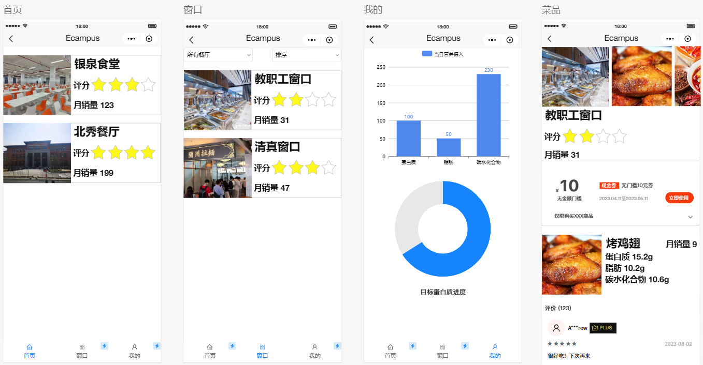

# Ecampus | 吃在校园
## 介绍
基于SpringBoot + Redis实现的校内用餐点评系统，包括登录、发布点评、商户查询、优惠券秒杀、营养数据统计等功能。

## 小程序UI

## 项目亮点
- 解决了校园内用餐选择困难，填补了校园内线上点评的应用空缺。
- 可统计用户每天的饮食营养成分摄入，推广健康饮食。
- 基于Redis实现了高性能，可适应高并发场景。
- 支持横向扩展的集群模式，可适应未来用户量增长的情况。